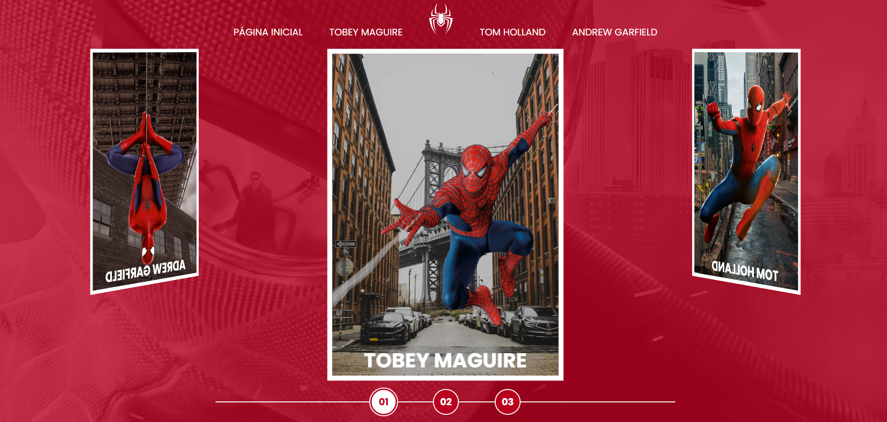
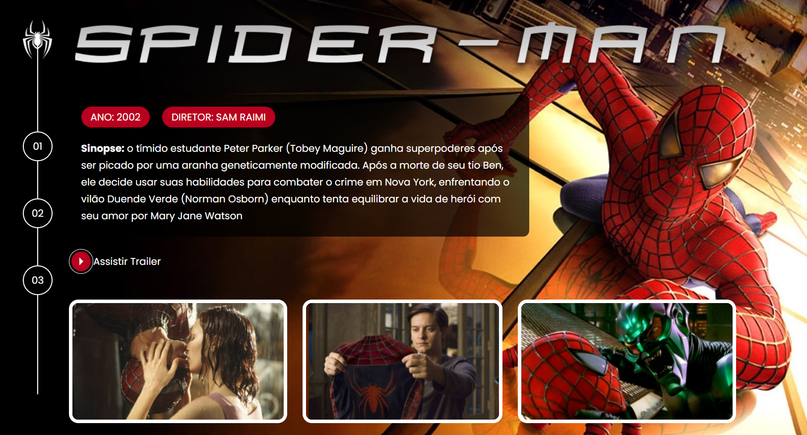

# 🕷️ Multiverso Spider-Man

Projeto desenvolvido durante o curso da DIO.me com o tema do multiverso do Homem-Aranha. O site apresenta os filmes do personagem em uma interface interativa e responsiva, utilizando HTML, CSS e JavaScript.

## 🚀 Funcionalidades

- Carousel interativo para navegação entre conteúdos;
- Galeria de imagens dos filmes;
- Integração com a biblioteca Fancybox para visualização dinâmica das imagens;
- Layout inspirado no universo Spider-Man;

## 🛠️ Tecnologias utilizadas

- HTML5
- CSS3
- JavaScript
- Fancybox

## 🎯 Objetivo do projeto

O projeto teve como objetivo praticar conceitos de desenvolvimento front-end, manipulação de elementos visuais com JavaScript e criação de interfaces interativas inspiradas no universo cinematográfico do Homem-Aranha.

